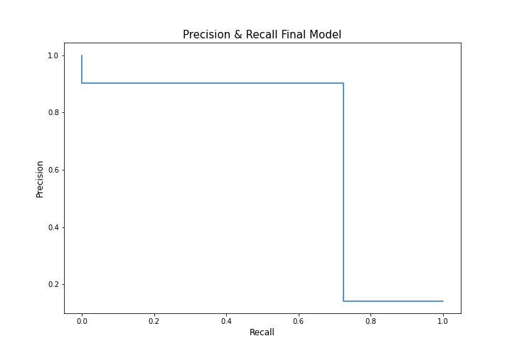
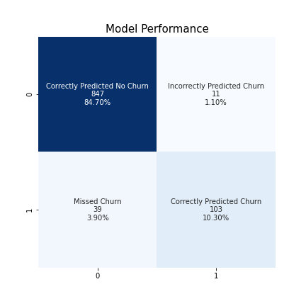
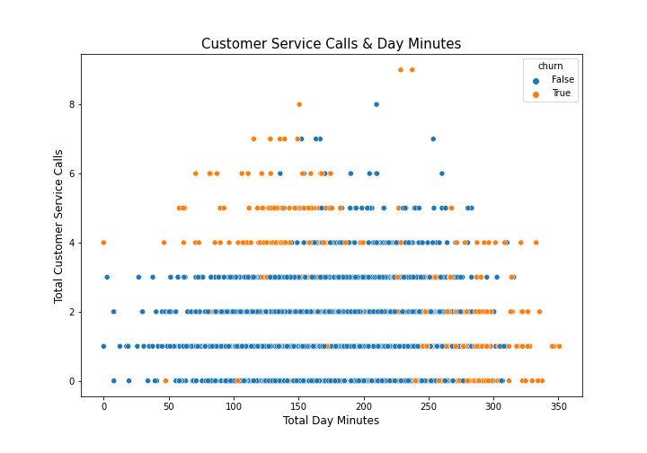

# Churn Buster: Customer Churn Prediction Tool

**Author**: [Alex FitzGerald](https://www.linkedin.com/in/alex-fitzgerald-0734076a/)


## Overview

This project focuses on a ficticious software company, Churn Buster, that is pitching their tool to Telecom Inc., a ficticious wireless service company. Churn Buster has built a predictive model to reduce Telecom Inc.'s customer churn. To build the model, Churn Buster analyzed 3,333 Telecom Inc. customer accounts. Churn Buster analyzed several models before choosing the model that produced the desired result. The winning model was random forrest comprised of 100 decision trees. The winning model produced an F1 score of 0.80 which significantly improved upon a baseline model's score of 0.25. The model would help Telecom Inc. predict which customers are likely to churn so they could intervene to save the account with discounts and customer support.

## Business Problem

Telecom Inc., an American telecomunications company, is competing with a an up-start company, Lightning Wireless, that has eaten into their majority market share in recent years. To re-gain their market share, Telecom Inc. must first address the issue of customer churn. Telecom Inc. needs a model to help them predict which of customers are likely to churn to they can intervene and save the accounts. They also want to know what factors contribute to churn so they can improve their service to prevent future churn.

To address these business challenges, Churn Buster will sell Telecom Inc. a model that helps predict customer churn. 
To evaluate the preformance of this model, Churn Buster will use F1 score because the Telecom Inc. wants to  capture true positives but is also concerned about minimizing false negatives and false positives. False positives are costly because in cases where our model predicts a customer will churn, Telecom Inc. intends to intervene with customer support and discounts. These interventions cost money, [$53K per year salary](https://www.indeed.com/career/customer-service-representative/salaries) for support representatives and discounts subrtract from the profitability of each customer they're offered to.

Given their business goals class imbalence of the data (0.81 majority class), F1 score does a better job evaluating the true performance of our model.

## Data

The data for this project was sourced from a [generic telecom churn dataset](https://www.kaggle.com/datasets/becksddf/churn-in-telecoms-dataset) containing 3,333 customer records. Each observation corresponds to a unique customer and is associated with 20 columns of of information about their customer (e.g. voicemail plan, daytime minutes) including whether or not the customer churned (our target). The target is imbalenced with the large majority of observations falling in the churn = False binary classification. The data contains phone numbers from the San Fransisco bay area associated with customers evenly spread out accross 50 U.S. states. There is no indication of when this data was collected.

## Methods
This project focuses on solving a classification problem with a predictive data science model. The problem at hand is predicting a customer's churn status (true/false). The project uses an iterative approach to building a predictive model that's both accurate and interpritible. In the process, I iterated through several model types, feature engineering methods, and hyperparameters.

## Results
The final model significantly improved Telecom Inc.'s ability to predict which customers are likely to churn. Compared to a baseline model, the final model improved F1 score by 0.55. 
-- **F1 Score: 0.80**
-- **Precision:** 0.90
-- **Recall:** 0.72


Our model balances recall and precision to meet Telecom Inc.'s business need to identify high risk customers without overpredicting churn.


The final model makes correct predictions 95% of the time. The model is very strong at correctly predicting which customers are unlikely to churn and minimizing false positives. The model struggles more with capturing all churned customers although when it does predict churn, it's highly accurate.


The final model is interpretable which is very useful for Telecom Inc. They can use the model to identify a given customer's churn likelihood and which factors influenced their risk profile. Armed with this information, they can take targeted interventions to save the customer. For example, if the customer has many customer service calls, Telecom Inc. can pair them with their most experiences customer service reps to give them the best experience possible. If the customer has a lot of day-time usage, we can offer them a discount on the service. For customers that aren't at risk of churning, they can withhold costly interventions.


## Conclusions

This predictive tool to three recommendations for improving operations of the Austin Animal Center:

-- **Engage in targeted outreach campaigns for dogs that have been sheltered at AAC for more than 30 days.** While most dogs will have been placed after 30 days, this may help reduce the number of dogs that end up having extended stays, potentially requiring many more months of care.
-- **Reduce current spending until the numbers of intakes and sheltered animals return to normal.** Given the reduced activity during this period, AAC should consider ways to temporarily reduce costs by changing space utilization or staffing.
-- **Hire seasonal staff and rent temporary space for May through December.** To accommodate the high volume of intakes and number of sheltered animals in the spring and fall, AAC should leverage seasonal resources, rather than full-year ones. This will allow AAC to cut back on expenditures during the months when there is lower

### Limitations & Next Steps

Further analyses could yield additional insights to further improve operations at AAC:

- **Limitations** Our model misses 28% of churning. The final model is overly fit to training data because F1 score dropped significantly from training to test evaluation.
- **Next Steps** More examples of churn customers to balance classes will improve overfitting issue. Adding customer payment information will improve accuracy. I can explore black-box models to improve recall.
- **Predicting undesirable outcomes.** This modeling could identify animals that are more likely to have undesirable outcomes (e.g. Euthanasia) for targeted medical support or outreach.

## For More Information

See the full analysis in the [Jupyter Notebook](./animal-shelter-needs-analysis.ipynb) or review this [presentation](./Animal_Shelter_Needs_Presentation.pdf).

For additional info, contact Alison Peebles Madigan at [alison.peeblesmadigan@flatironschool.com](mailto:alison.peeblesmadigan@flatironschool.com)


## Repository Structure

```
├── code
│   ├── __init__.py
│   ├── data_preparation.py
│   ├── visualizations.py
│   └── eda_notebook.ipynb
├── data
├── images
├── __init__.py
├── README.md
├── Animal_Shelter_Needs_Presentation.pdf
└── animal_shelter_needs_analysis.ipynb
```
